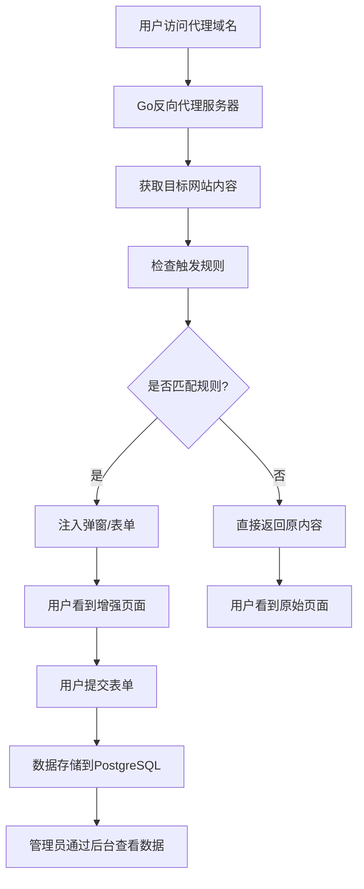

# 智能反向代理平台 - 产品需求文档

## 1. 产品概述

智能反向代理平台是一个基于Go语言开发的企业级解决方案，能够完全代理目标网站到自有域名，并在代理过程中注入自定义的交互功能。系统主要解决企业需要在不修改原网站代码的情况下，增加自定义交互功能（如弹窗、表单收集）的需求，适用于营销活动、用户调研、数据收集等场景。

为企业提供无侵入式的网站功能增强解决方案，降低技术门槛，提升用户交互体验，实现快速的营销转化和数据收集。

## 2. 核心功能

### 2.1 用户角色

| 角色 | 注册方式 | 核心权限 |
|------|----------|----------|
| 系统管理员 | 系统预设账号 | 管理所有代理配置、查看所有数据、系统设置 |
| 运营人员 | 管理员后台添加 | 配置代理规则、设计弹窗表单、查看收集数据 |

### 2.2 功能模块

系统包含以下核心页面：

1. **代理管理页面**：代理配置、域名绑定、目标网站设置
2. **规则配置页面**：触发条件设置、弹窗表单设计、展示规则配置
3. **数据收集页面**：用户提交数据查看、数据导出、统计分析
4. **系统设置页面**：用户管理、权限配置、系统监控
5. **代理前台页面**：用户实际访问的代理网站界面

### 2.3 页面详情

| 页面名称 | 模块名称 | 功能描述 |
|----------|----------|----------|
| 代理管理页面 | 代理配置模块 | 添加、编辑、删除代理配置；设置目标网站URL；配置域名绑定；启动停止代理服务 |
| 代理管理页面 | 状态监控模块 | 显示代理服务状态；监控流量统计；错误日志查看；性能指标展示 |
| 规则配置页面 | 触发条件设置 | 配置URL路径匹配规则；设置触发时机（页面加载、接口调用等）；条件逻辑组合 |
| 规则配置页面 | 弹窗设计器 | 可视化设计弹窗样式；配置弹窗内容、按钮、表单字段；实时预览效果 |
| 规则配置页面 | 表单构建器 | 拖拽式表单设计；字段类型选择；验证规则设置；样式自定义 |
| 数据收集页面 | 数据列表 | 实时显示用户提交数据；支持筛选、搜索、分页；数据详情查看 |
| 数据收集页面 | 数据分析 | 提交量统计图表；数据趋势分析；导出Excel/CSV；报表生成 |
| 系统设置页面 | 用户管理 | 添加、编辑用户账号；权限分配；登录日志；账号状态管理 |
| 系统设置页面 | 系统配置 | 数据库连接设置；缓存配置；安全参数设置；系统监控 |
| 代理前台页面 | 内容代理 | 完全代理目标网站内容；保持原有样式和功能；URL重写处理 |
| 代理前台页面 | 功能注入 | 根据配置规则注入弹窗；处理表单提交；数据收集；用户行为追踪 |

## 3. 核心流程

### 管理员流程
1. 登录管理后台
2. 配置代理目标网站（设置a.com为目标，b.com为代理域名）
3. 设置触发规则（指定哪些URL路径或接口触发自定义功能）
4. 设计弹窗和表单（配置样式、字段、验证规则）
5. 启动代理服务
6. 监控数据收集和系统状态

### 普通用户流程
1. 访问代理网站（b.com）
2. 浏览网站内容（与a.com完全一致）
3. 触发预设条件时看到弹窗或表单
4. 填写并提交表单数据
5. 继续正常浏览网站

## 4. 用户界面设计

### 4.1 设计风格

- **主色调**：深黑色(#0a0a0a)作为主背景色，亮绿色(#00ff88)作为强调色和交互元素色
- **辅助色调**：深灰色(#1a1a1a)作为卡片背景，中灰色(#2a2a2a)作为边框色，浅绿色(#4ade80)作为次要强调色
- **按钮风格**：现代化圆角按钮，主要按钮使用绿色渐变(#00ff88到#4ade80)，支持发光悬停效果和流畅动画反馈
- **字体**：现代无衬线字体(Inter/SF Pro Display)，标题使用18-24px加粗，正文使用14-16px，代码字体使用JetBrains Mono
- **布局风格**：暗色左侧导航栏配绿色激活状态 + 深色主内容区域，采用现代化卡片式布局，支持微妙阴影和边框发光效果
- **图标风格**：使用现代化线性图标，支持绿色主题适配，激活状态带有绿色发光效果

### 4.2 页面设计概览

| 页面名称 | 模块名称 | UI元素 |
|----------|----------|--------|
| 代理管理页面 | 代理配置模块 | 深色背景表格展示代理列表，绿色渐变操作按钮（新增/编辑/删除），状态指示器（绿色发光运行/红色停止），实时状态徽章 |
| 代理管理页面 | 状态监控模块 | 深色实时数据卡片配绿色边框，绿色主题折线图显示流量趋势，深色日志列表滚动显示，性能指标仪表盘 |
| 规则配置页面 | 触发条件设置 | 深色背景URL输入框配绿色聚焦边框，暗色下拉选择触发类型，绿色开关按钮启用/禁用规则，条件逻辑构建器 |
| 规则配置页面 | 弹窗设计器 | 深色可视化预览区域，暗色属性配置面板，现代化颜色选择器，绿色主题字体大小滑块，实时预览窗口 |
| 数据收集页面 | 数据列表 | 深色分页表格配绿色表头，暗色搜索框，深色日期筛选器，绿色渐变导出按钮，数据统计卡片 |
| 数据收集页面 | 数据分析 | 绿色主题柱状图/饼图展示，深色数据统计卡片配绿色强调，暗色时间范围选择器，交互式图表控件 |
| 代理前台页面 | 功能注入 | 深色模态弹窗配绿色边框，半透明深色遮罩，暗色表单输入框配绿色聚焦效果，绿色渐变提交按钮动画效果 |

### 4.3 响应式设计

系统采用桌面优先设计，支持移动端自适应。管理后台主要面向桌面用户，代理前台页面需要完全适配移动端，确保在各种设备上都能正常显示和操作。触摸交互优化，支持手势操作和移动端特有的用户体验。