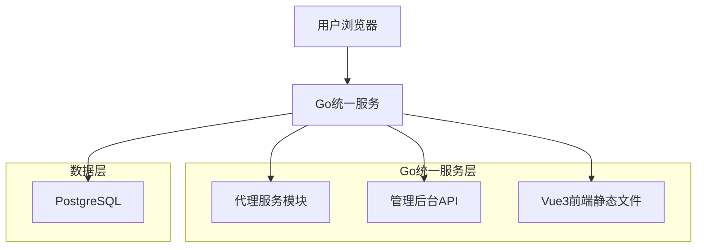
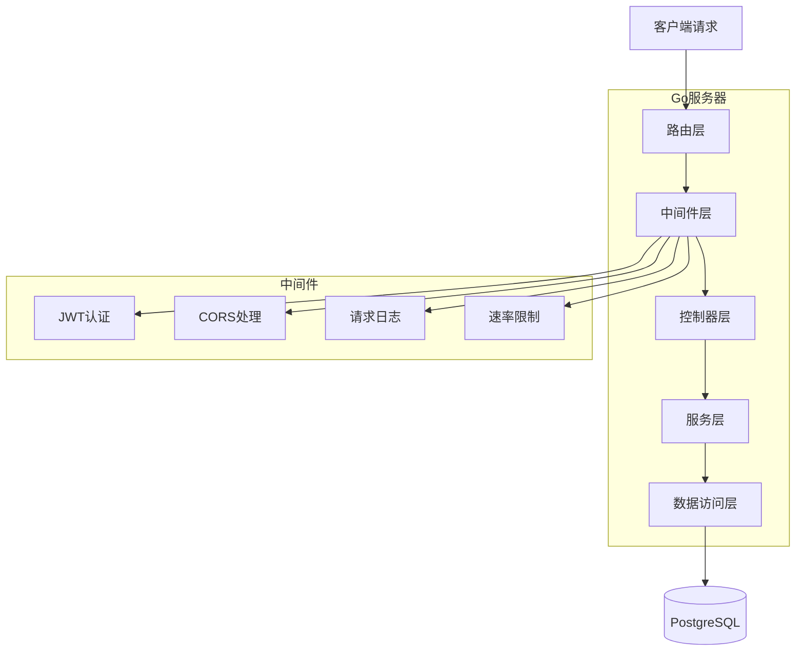
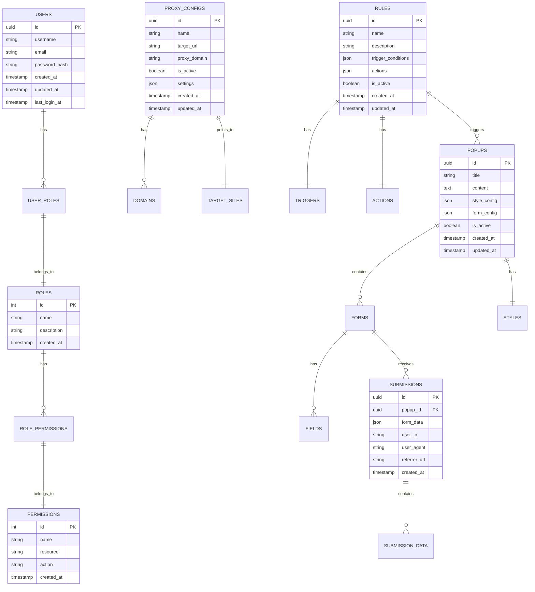

# 智能反向代理平台 - 技术架构文档

## 1. 架构设计



## 2. 技术描述

* **前端**: Vue 3 + TypeScript + Element Plus + Vite + Pinia + Axios

* **后端**: Go 1.21+ + net/http + gorilla/mux + GORM + JWT + Viper

* **数据库**: PostgreSQL (本地部署)

* **反向代理**: net/http/httputil.ReverseProxy

* **模板引擎**: html/template

## 3. 路由定义

| 路由              | 用途                   |
| --------------- | -------------------- |
| /admin          | 管理后台首页，显示系统概览和导航     |
| /admin/login    | 登录页面，JWT认证           |
| /admin/proxy    | 代理管理页面，配置和监控代理服务     |
| /admin/rules    | 规则配置页面，设置触发条件和弹窗表单   |
| /admin/data     | 数据收集页面，查看和分析用户提交数据   |
| /admin/settings | 系统设置页面，用户管理和系统配置     |
| /\*             | 代理前台页面，处理所有代理请求和内容注入 |

## 4. API定义

### 4.1 核心API

#### 用户认证相关

```
POST /api/auth/login
```

请求:

| 参数名      | 参数类型   | 是否必需 | 描述  |
| -------- | ------ | ---- | --- |
| username | string | true | 用户名 |
| password | string | true | 密码  |

响应:

| 参数名     | 参数类型    | 描述      |
| ------- | ------- | ------- |
| success | boolean | 登录是否成功  |
| token   | string  | JWT访问令牌 |
| user    | object  | 用户信息    |

示例:

```json
{
  "username": "admin",
  "password": "password123"
}
```

#### 代理配置管理

```
GET /api/proxy/configs
POST /api/proxy/configs
PUT /api/proxy/configs/{id}
DELETE /api/proxy/configs/{id}
```

#### 规则配置管理

```
GET /api/rules
POST /api/rules
PUT /api/rules/{id}
DELETE /api/rules/{id}
```

#### 弹窗表单管理

```
GET /api/popups
POST /api/popups
PUT /api/popups/{id}
DELETE /api/popups/{id}
```

#### 数据收集管理

```
GET /api/submissions
POST /api/submissions
GET /api/analytics
GET /api/export
```

## 5. 服务器架构图



## 6. 数据模型

### 6.1 数据模型定义



### 6.2 数据定义语言

#### 用户表 (users)

```sql
-- 创建用户表
CREATE TABLE users (
    id UUID PRIMARY KEY DEFAULT gen_random_uuid(),
    username VARCHAR(50) UNIQUE NOT NULL,
    email VARCHAR(255) UNIQUE NOT NULL,
    password_hash VARCHAR(255) NOT NULL,
    created_at TIMESTAMP WITH TIME ZONE DEFAULT NOW(),
    updated_at TIMESTAMP WITH TIME ZONE DEFAULT NOW(),
    last_login_at TIMESTAMP WITH TIME ZONE
);

-- 创建索引
CREATE INDEX idx_users_username ON users(username);
CREATE INDEX idx_users_email ON users(email);
CREATE INDEX idx_users_created_at ON users(created_at DESC);

-- 初始数据
INSERT INTO users (username, email, password_hash) VALUES 
('admin', 'admin@example.com', '$2a$10$encrypted_password_hash');
```

#### 角色权限表

```sql
-- 创建角色表
CREATE TABLE roles (
    id SERIAL PRIMARY KEY,
    name VARCHAR(50) UNIQUE NOT NULL,
    description TEXT,
    created_at TIMESTAMP WITH TIME ZONE DEFAULT NOW()
);

-- 创建权限表
CREATE TABLE permissions (
    id SERIAL PRIMARY KEY,
    name VARCHAR(100) UNIQUE NOT NULL,
    resource VARCHAR(50) NOT NULL,
    action VARCHAR(50) NOT NULL,
    created_at TIMESTAMP WITH TIME ZONE DEFAULT NOW()
);

-- 创建用户角色关联表
CREATE TABLE user_roles (
    user_id UUID REFERENCES users(id) ON DELETE CASCADE,
    role_id INTEGER REFERENCES roles(id) ON DELETE CASCADE,
    created_at TIMESTAMP WITH TIME ZONE DEFAULT NOW(),
    PRIMARY KEY (user_id, role_id)
);

-- 创建角色权限关联表
CREATE TABLE role_permissions (
    role_id INTEGER REFERENCES roles(id) ON DELETE CASCADE,
    permission_id INTEGER REFERENCES permissions(id) ON DELETE CASCADE,
    created_at TIMESTAMP WITH TIME ZONE DEFAULT NOW(),
    PRIMARY KEY (role_id, permission_id)
);

-- 初始数据
INSERT INTO roles (name, description) VALUES 
('admin', '系统管理员'),
('operator', '运营人员');

INSERT INTO permissions (name, resource, action) VALUES 
('proxy.manage', 'proxy', 'manage'),
('rules.manage', 'rules', 'manage'),
('data.view', 'data', 'view'),
('users.manage', 'users', 'manage');
```

#### 代理配置表

```sql
-- 创建代理配置表
CREATE TABLE proxy_configs (
    id UUID PRIMARY KEY DEFAULT gen_random_uuid(),
    name VARCHAR(100) NOT NULL,
    target_url VARCHAR(500) NOT NULL,
    proxy_domain VARCHAR(255) NOT NULL,
    is_active BOOLEAN DEFAULT false,
    settings JSONB DEFAULT '{}',
    created_at TIMESTAMP WITH TIME ZONE DEFAULT NOW(),
    updated_at TIMESTAMP WITH TIME ZONE DEFAULT NOW()
);

-- 创建域名表
CREATE TABLE domains (
    id UUID PRIMARY KEY DEFAULT gen_random_uuid(),
    proxy_config_id UUID REFERENCES proxy_configs(id) ON DELETE CASCADE,
    domain VARCHAR(255) NOT NULL,
    is_primary BOOLEAN DEFAULT false,
    ssl_enabled BOOLEAN DEFAULT false,
    created_at TIMESTAMP WITH TIME ZONE DEFAULT NOW()
);

-- 创建索引
CREATE INDEX idx_proxy_configs_active ON proxy_configs(is_active);
CREATE INDEX idx_domains_domain ON domains(domain);
CREATE INDEX idx_domains_proxy_config ON domains(proxy_config_id);
```

#### 规则引擎表

```sql
-- 创建规则表
CREATE TABLE rules (
    id UUID PRIMARY KEY DEFAULT gen_random_uuid(),
    name VARCHAR(100) NOT NULL,
    description TEXT,
    trigger_conditions JSONB NOT NULL,
    actions JSONB NOT NULL,
    is_active BOOLEAN DEFAULT true,
    priority INTEGER DEFAULT 0,
    created_at TIMESTAMP WITH TIME ZONE DEFAULT NOW(),
    updated_at TIMESTAMP WITH TIME ZONE DEFAULT NOW()
);

-- 创建索引
CREATE INDEX idx_rules_active ON rules(is_active);
CREATE INDEX idx_rules_priority ON rules(priority DESC);
CREATE INDEX idx_rules_created_at ON rules(created_at DESC);
```

#### 弹窗表单表

```sql
-- 创建弹窗表
CREATE TABLE popups (
    id UUID PRIMARY KEY DEFAULT gen_random_uuid(),
    title VARCHAR(200) NOT NULL,
    content TEXT,
    style_config JSONB DEFAULT '{}',
    form_config JSONB DEFAULT '{}',
    is_active BOOLEAN DEFAULT true,
    created_at TIMESTAMP WITH TIME ZONE DEFAULT NOW(),
    updated_at TIMESTAMP WITH TIME ZONE DEFAULT NOW()
);

-- 创建数据提交表
CREATE TABLE submissions (
    id UUID PRIMARY KEY DEFAULT gen_random_uuid(),
    popup_id UUID REFERENCES popups(id) ON DELETE CASCADE,
    form_data JSONB NOT NULL,
    user_ip INET,
    user_agent TEXT,
    referrer_url TEXT,
    created_at TIMESTAMP WITH TIME ZONE DEFAULT NOW()
);

-- 创建索引
CREATE INDEX idx_popups_active ON popups(is_active);
CREATE INDEX idx_submissions_popup_id ON submissions(popup_id);
CREATE INDEX idx_submissions_created_at ON submissions(created_at DESC);
CREATE INDEX idx_submissions_user_ip ON submissions(user_ip);
```

#### 权限设置

```sql
-- 为anon角色授予基本读取权限
GRANT SELECT ON users, roles, permissions TO anon;
GRANT SELECT ON proxy_configs, domains TO anon;
GRANT SELECT ON rules TO anon;
GRANT SELECT ON popups TO anon;
GRANT INSERT ON submissions TO anon;

-- 为authenticated角色授予完整权限
GRANT ALL PRIVILEGES ON ALL TABLES IN SCHEMA public TO authenticated;
GRANT ALL PRIVILEGES ON ALL SEQUENCES IN SCHEMA public TO authenticated;
```

