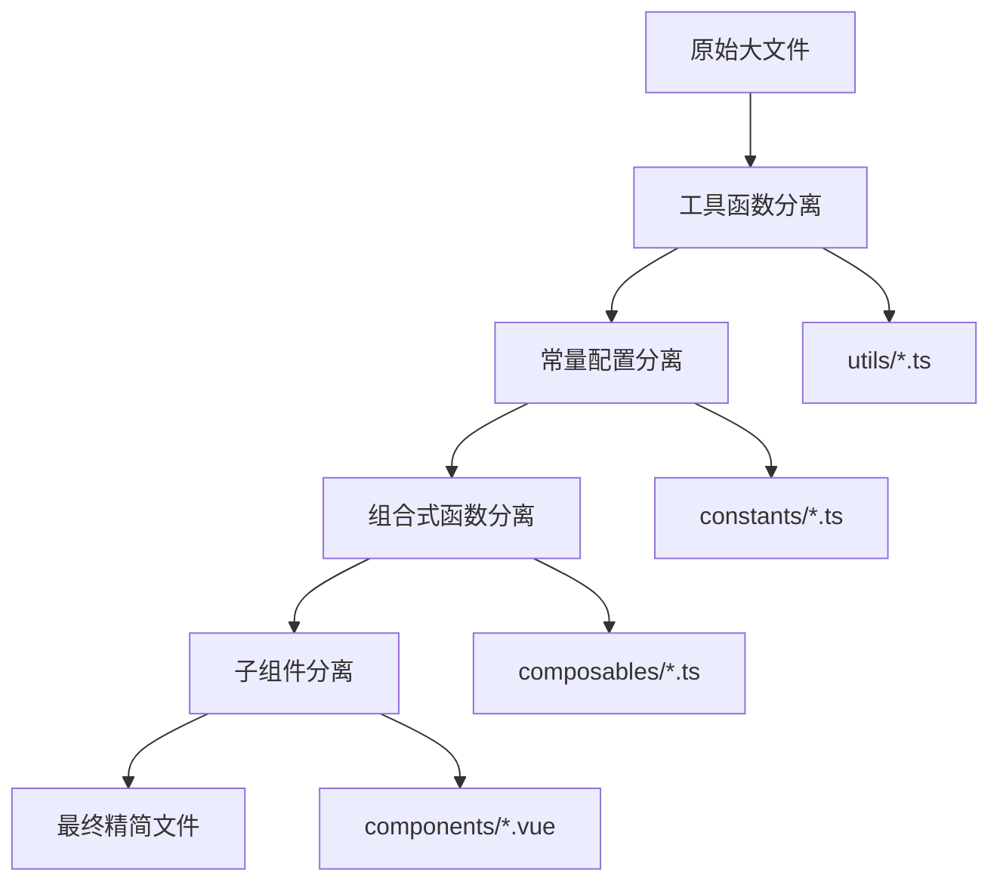

# 文件分离总体实施计划

## 1. 项目概述

### 1.1 分离目标

本项目旨在对超过300行的大型Vue文件进行安全、渐进式的分离重构，将单一大文件拆分为多个职责明确的小模块，提升代码的可维护性、可测试性和可复用性。

### 1.2 待分离文件清单

| 文件路径 | 当前行数 | 优先级 | 预期减少 | 目标行数 |
|----------|----------|--------|----------|----------|
| `/web/src/views/proxy/ProxyManagement.vue` | 809行 | 🔴 高 | 75% | ~200行 |
| `/web/src/views/data/DataCollection.vue` | 373行 | 🟡 中 | 60% | ~150行 |
| `/web/src/views/settings/SystemSettings.vue` | 338行 | 🟡 中 | 47% | ~180行 |
| `/web/src/views/dashboard/Dashboard.vue` | 323行 | 🟢 低 | 54% | ~150行 |

## 2. 分离策略总览

### 2.1 分离原则

1. **零风险原则**：任何分离操作都不能影响现有功能
2. **渐进式原则**：一次只分离一个文件，确保每步都稳定
3. **可回滚原则**：每次分离都要确保可以快速回滚
4. **充分测试原则**：分离后必须验证所有相关功能正常运行
5. **接口一致原则**：分离后的组件和函数接口要与原有逻辑完全一致

### 2.2 分离层次

### 2.3 分离模式

#### 模式一：工具函数分离
- **目标**：提取纯函数和工具方法
- **收益**：提高复用性，便于单元测试
- **风险**：低

#### 模式二：常量配置分离
- **目标**：提取配置项、选项列表、默认值
- **收益**：集中管理配置，便于维护
- **风险**：低

#### 模式三：组合式函数分离
- **目标**：提取业务逻辑和状态管理
- **收益**：逻辑复用，代码组织更清晰
- **风险**：中

#### 模式四：子组件分离
- **目标**：提取独立的UI组件
- **收益**：组件复用，降低复杂度
- **风险**：中

## 3. 详细实施计划

### 3.1 第一阶段：ProxyManagement.vue 分离 (第1-2周)

#### 3.1.1 准备工作 (第1天)
- [ ] 创建分离分支 `feature/refactor-proxy-management`
- [ ] 备份原始文件
- [ ] 准备测试用例

#### 3.1.2 工具函数分离 (第2-3天)
- [ ] 创建 `/web/src/utils/proxyUtils.ts`
- [ ] 迁移工具函数：
  - `getTypeTagType`
  - `getStatusTagType` 
  - `getStatusText`
  - `formatBytes`
  - `formatDate`
- [ ] 更新主文件引用
- [ ] 功能测试验证

#### 3.1.3 常量配置分离 (第4天)
- [ ] 创建 `/web/src/constants/proxyConstants.ts`
- [ ] 迁移常量配置：
  - `PROXY_TYPE_OPTIONS`
  - `PROXY_STATUS_OPTIONS`
  - `PAGE_SIZE_OPTIONS`
  - `DEFAULT_PAGINATION`
  - `DEFAULT_SEARCH_FORM`
  - `DEFAULT_PROXY_FORM`
  - `PROXY_FORM_RULES`
- [ ] 更新主文件引用
- [ ] 功能测试验证

#### 3.1.4 子组件分离 (第5-7天)
- [ ] 创建 `ProxyStats.vue` 组件
- [ ] 创建 `ProxySearchFilter.vue` 组件
- [ ] 创建 `ProxyList.vue` 组件
- [ ] 创建 `ProxyFormDialog.vue` 组件
- [ ] 更新主文件，集成子组件
- [ ] 完整功能测试

#### 3.1.5 组合式函数分离 (第8-10天)
- [ ] 创建 `useProxyManagement.ts`
- [ ] 创建 `useProxyStats.ts`
- [ ] 创建 `useProxyForm.ts`
- [ ] 迁移业务逻辑到组合式函数
- [ ] 更新主文件，使用组合式函数
- [ ] 全面测试验证

#### 3.1.6 验收和合并 (第11-14天)
- [ ] 代码审查
- [ ] 性能测试
- [ ] 用户验收测试
- [ ] 合并到主分支
- [ ] 部署验证

### 3.2 第二阶段：DataCollection.vue 分离 (第3-4周)

#### 3.2.1 准备工作 (第15天)
- [ ] 创建分离分支 `feature/refactor-data-collection`
- [ ] 分析现有组件结构
- [ ] 制定分离计划

#### 3.2.2 组合式函数分离 (第16-18天)
- [ ] 创建 `usePopupManagement.ts`
- [ ] 创建 `useSubmissionManagement.ts`
- [ ] 创建 `useDataCollectionState.ts`
- [ ] 迁移事件处理逻辑
- [ ] 功能测试验证

#### 3.2.3 优化和验收 (第19-21天)
- [ ] 代码优化
- [ ] 完整测试
- [ ] 代码审查
- [ ] 合并部署

### 3.3 第三阶段：SystemSettings.vue 分离 (第5周)

#### 3.3.1 组件分离 (第22-24天)
- [ ] 创建 `SystemInfoDialog.vue`
- [ ] 创建 `useSystemData.ts`
- [ ] 迁移系统信息逻辑
- [ ] 测试验证

#### 3.3.2 验收合并 (第25-28天)
- [ ] 完整测试
- [ ] 代码审查
- [ ] 合并部署

### 3.4 第四阶段：Dashboard.vue 分离 (第6周)

#### 3.4.1 数据逻辑分离 (第29-31天)
- [ ] 创建 `useDashboardData.ts`
- [ ] 创建 `useAutoRefresh.ts`
- [ ] 迁移数据管理逻辑
- [ ] 测试验证

#### 3.4.2 最终验收 (第32-35天)
- [ ] 全项目回归测试
- [ ] 性能对比分析
- [ ] 文档更新
- [ ] 项目总结

## 4. 风险控制措施

### 4.1 技术风险控制

#### 4.1.1 代码风险
- **风险**：分离过程中引入bug
- **控制措施**：
  - 每次分离后立即进行功能测试
  - 保持原有接口不变
  - 使用TypeScript确保类型安全
  - 建立自动化测试用例

#### 4.1.2 性能风险
- **风险**：分离后性能下降
- **控制措施**：
  - 分离前后进行性能对比
  - 避免过度拆分导致的性能损失
  - 合理使用懒加载和代码分割

#### 4.1.3 兼容性风险
- **风险**：分离后与其他模块不兼容
- **控制措施**：
  - 保持对外接口稳定
  - 进行集成测试
  - 渐进式迁移，避免大范围影响

### 4.2 项目风险控制

#### 4.2.1 进度风险
- **风险**：分离工作影响正常开发进度
- **控制措施**：
  - 合理安排分离时间
  - 优先级管理，先处理最大的文件
  - 并行开发，不阻塞其他功能

#### 4.2.2 团队协作风险
- **风险**：分离过程中代码冲突
- **控制措施**：
  - 使用独立分支进行分离
  - 及时沟通分离进展
  - 建立代码审查机制

## 5. 质量保证措施

### 5.1 测试策略

#### 5.1.1 单元测试
- 为分离出的工具函数编写单元测试
- 为组合式函数编写测试用例
- 确保测试覆盖率不低于80%

#### 5.1.2 集成测试
- 测试分离后组件间的交互
- 验证数据流的正确性
- 确保用户操作流程完整

#### 5.1.3 端到端测试
- 模拟真实用户操作场景
- 验证完整业务流程
- 确保用户体验不受影响

### 5.2 代码审查

#### 5.2.1 审查要点
- 代码结构是否合理
- 命名是否清晰
- 注释是否充分
- 性能是否优化
- 安全性是否考虑

#### 5.2.2 审查流程
1. 开发者自检
2. 同行代码审查
3. 技术负责人审查
4. 测试团队验证
5. 产品经理验收

## 6. 成功标准

### 6.1 技术指标

| 指标 | 目标值 | 测量方法 |
|------|--------|----------|
| 文件行数减少 | >60% | 代码行数统计 |
| 功能完整性 | 100% | 功能测试通过率 |
| 性能影响 | <5% | 页面加载时间对比 |
| 代码复用率 | >30% | 工具函数使用统计 |
| 测试覆盖率 | >80% | 自动化测试报告 |

### 6.2 业务指标

| 指标 | 目标值 | 测量方法 |
|------|--------|----------|
| 用户体验 | 无影响 | 用户反馈 |
| 系统稳定性 | 99.9% | 错误率监控 |
| 开发效率 | 提升20% | 开发时间统计 |
| 维护成本 | 降低30% | 维护工时统计 |

## 7. 后续优化计划

### 7.1 短期优化 (1-2个月)
- 建立组件库，提高复用性
- 完善自动化测试体系
- 优化构建和部署流程

### 7.2 中期优化 (3-6个月)
- 引入微前端架构
- 实施代码分割和懒加载
- 建立性能监控体系

### 7.3 长期优化 (6-12个月)
- 完善开发规范和最佳实践
- 建立代码质量度量体系
- 推广到其他项目

## 8. 总结

本文件分离计划采用渐进式、零风险的策略，通过系统性的分离重构，将大型Vue文件拆分为职责明确的小模块。计划分4个阶段实施，预计6周完成，最终实现代码可维护性、可测试性和可复用性的显著提升。

通过严格的风险控制措施和质量保证体系，确保分离过程不影响系统稳定性和用户体验，为项目的长期发展奠定坚实基础。

---

*请严格按照此计划执行，确保每个阶段的目标达成和质量标准满足。*