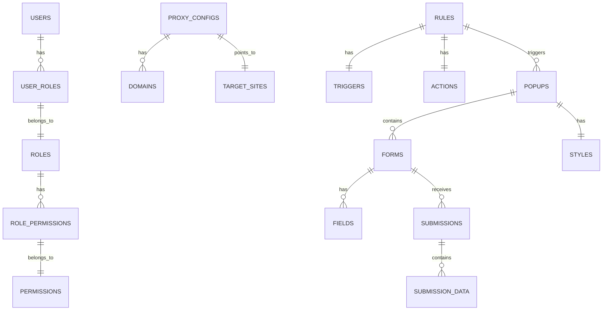

# Proxy Enhancer Ultra - 项目总结

## 📋 项目概览

### 项目简介
Proxy Enhancer Ultra 是一个基于 Go 语言开发的智能反向代理平台，能够完全代理目标网站到自有域名，并在代理过程中注入自定义的交互功能。系统主要解决企业需要在不修改原网站代码的情况下，增加自定义交互功能（如弹窗、表单收集）的需求。

### 核心价值
- **无侵入式增强**：无需修改原网站代码即可添加功能
- **完全代理**：保持原网站的完整样式和功能
- **智能注入**：根据规则动态注入弹窗和表单
- **数据收集**：实时收集用户提交数据，支持导出和分析

### 适用场景
- 企业营销活动页面增强
- 用户调研和数据收集
- 网站功能无侵入式扩展
- 代理服务定制化需求

## 🏗️ 技术架构

### 技术栈选择

#### 后端技术栈
- **核心语言**：Go 1.21+ - 高性能、并发处理能力强
- **Web框架**：标准库 net/http + gorilla/mux - 灵活的路由系统
- **反向代理**：net/http/httputil.ReverseProxy - 专门的反向代理工具
- **数据库**：PostgreSQL + GORM - 强大的 ORM 和本地数据库
- **认证**：JWT (golang-jwt/jwt) - 安全的用户认证机制
- **配置管理**：Viper - 灵活的配置管理
- **日志**：Logrus - 结构化日志记录

#### 前端技术栈
- **框架**：Vue 3 + TypeScript - 现代化前端技术，类型安全
- **UI组件库**：Element Plus - 丰富的企业级组件
- **构建工具**：Vite - 快速的构建和开发体验
- **状态管理**：Pinia - Vue 3 官方推荐的状态管理
- **HTTP客户端**：Axios - 强大的 HTTP 请求库
- **路由**：Vue Router 4 - Vue 3 官方路由

### 架构设计

#### 统一架构模式
```
┌─────────────────────────────────────────────────────────────────┐
│                        用户访问层                                │
├─────────────────────────────────────────────────────────────────┤
│  ┌─────────────┐  ┌─────────────┐  ┌─────────────┐            │
│  │   代理域名   │  │  管理后台   │  │   API接口   │            │
│  │   (b.com)   │  │  (/admin)   │  │   (/api)    │            │
│  └─────────────┘  └─────────────┘  └─────────────┘            │
└─────────────────────────────────────────────────────────────────┘
                                │
                                ▼
┌─────────────────────────────────────────────────────────────────┐
│                    Go 统一服务层                                │
├─────────────────────────────────────────────────────────────────┤
│  ┌─────────────┐  ┌─────────────┐  ┌─────────────┐            │
│  │  路由分发器  │  │  中间件层   │  │  处理器层   │            │
│  │  gorilla/mux│  │  JWT/CORS   │  │  Handlers   │            │
│  └─────────────┘  └─────────────┘  └─────────────┘            │
│                                │                               │
│  ┌─────────────┐  ┌─────────────┐  ┌─────────────┐            │
│  │  代理服务   │  │  业务服务   │  │  数据访问   │            │
│  │  ReverseProxy│  │  Services   │  │    GORM     │            │
│  └─────────────┘  └─────────────┘  └─────────────┘            │
└─────────────────────────────────────────────────────────────────┘
                                │
                                ▼
┌─────────────────────────────────────────────────────────────────┐
│                        数据存储层                                │
├─────────────────────────────────────────────────────────────────┤
│  ┌─────────────┐  ┌─────────────┐  ┌─────────────┐            │
│  │ PostgreSQL  │  │   缓存     │  │   日志     │            │
│  │   (本地)    │  │   Redis     │  │  文件系统   │            │
│  └─────────────┘  └─────────────┘  └─────────────┘            │
└─────────────────────────────────────────────────────────────────┘
```

#### 架构优势
1. **统一部署**：前后端统一部署，简化运维
2. **无跨域问题**：所有请求通过同一个服务处理
3. **高性能**：基于 Go 的并发处理能力
4. **模块化设计**：清晰的职责分离，便于维护

## 📁 项目结构

### 目录结构
```
proxy-enhancer-ultra/
├── cmd/                           # 程序入口点
│   └── server/                    # 服务器主程序
│       └── main.go               # 主函数，启动服务器
├── internal/                      # 内部包（不对外暴露）
│   ├── auth/                     # 认证模块
│   ├── config/                   # 配置管理
│   ├── database/                 # 数据库层
│   ├── handlers/                 # HTTP 处理器
│   ├── middleware/               # 中间件
│   ├── models/                   # 数据模型
│   ├── proxy/                    # 代理服务核心
│   └── services/                 # 业务逻辑服务
├── pkg/                          # 公共包（可被外部引用）
├── web/                          # 前端应用
├── configs/                      # 配置文件目录
├── docs/                         # 项目文档
├── .trae/                        # Trae 开发文档
└── config.yaml.example           # 配置文件模板
```

### 核心模块职责

#### 1. **代理服务模块** (`internal/proxy/`)
- **核心功能**：反向代理目标网站，内容注入和修改
- **技术实现**：使用 `httputil.ReverseProxy` 实现
- **关键特性**：支持响应内容修改，动态注入弹窗

#### 2. **规则引擎模块** (`internal/services/rule_service.go`)
- **核心功能**：规则条件匹配，触发动作执行
- **规则类型**：URL 模式匹配、页面加载触发、滚动触发等
- **优先级管理**：支持规则优先级设置

#### 3. **弹窗注入模块**
- **注入策略**：页面加载后、滚动触发、时间延迟、点击触发
- **样式配置**：支持自定义样式、动画效果
- **表单处理**：动态表单构建、数据收集

## 🛣️ 路由系统

### 路由层次结构

#### 1. **管理后台路由** (`/admin/*`)
- `/admin/login` - 登录页面
- `/admin/proxy` - 代理管理页面
- `/admin/rules` - 规则配置页面
- `/admin/data` - 数据收集页面
- `/admin/settings` - 系统设置页面

#### 2. **API 接口路由** (`/api/*`)
- `/api/auth/*` - 认证相关接口
- `/api/proxy/*` - 代理配置管理接口
- `/api/rules/*` - 规则管理接口
- `/api/popups/*` - 弹窗管理接口
- `/api/submissions/*` - 数据提交接口

#### 3. **代理前台路由** (`/*`)
- 通配符路由，处理所有代理请求
- 根据配置规则决定是否注入弹窗
- 返回代理后的网站内容

### 路由匹配原理

#### 路由优先级
1. **精确匹配**：`/admin`, `/api` - 优先级最高
2. **前缀匹配**：`/admin/`, `/api/` - 中等优先级
3. **通配符匹配**：`/*` - 优先级最低，必须放在最后

#### 中间件链式调用
```go
// 中间件注册顺序
router.Use(
    middleware.Logging,      // 日志记录
    middleware.CORS,         // 跨域处理
    middleware.Recovery,     // 错误恢复
)

// API 路由中间件
apiRouter := router.PathPrefix("/api").Subrouter()
apiRouter.Use(
    middleware.RateLimit,    // 速率限制
    middleware.JWTAuth,      // JWT 认证
)
```

## 🔄 数据流架构

### 请求处理流程

#### 1. **管理后台页面访问**
```
GET /admin/proxy
    ↓
路由匹配: /admin/{rest:.*}
    ↓
中间件: CORS, Logging
    ↓
处理器: adminHandler.ServeAdmin
    ↓
返回: Vue 应用 HTML + 静态资源
```

#### 2. **API 接口调用**
```
POST /api/auth/login
    ↓
路由匹配: /api/auth/login
    ↓
中间件: CORS, Logging
    ↓
处理器: authHandler.Login
    ↓
业务服务: authService.Authenticate
    ↓
数据访问: userRepository.FindByUsername
    ↓
数据库: SELECT * FROM users WHERE username = ?
    ↓
返回: JWT Token + 用户信息
```

#### 3. **代理请求处理**
```
GET / (任意路径)
    ↓
路由匹配: /* (通配符)
    ↓
处理器: proxyHandler.ServeProxy
    ↓
业务服务: proxyService.ProcessRequest
    ↓
1. 获取目标网站内容
2. 检查触发规则
3. 注入弹窗/表单
4. 返回增强后的内容
```

### 数据模型关系



## 🔒 安全机制

### 1. **JWT 认证机制**
- **Token 结构**：包含用户ID、用户名、角色、过期时间等信息
- **安全特性**：支持 Token 刷新、过期时间管理
- **中间件验证**：自动验证 Token 有效性，提取用户信息

### 2. **权限控制系统**
- **角色管理**：系统管理员、运营人员等角色
- **权限分配**：细粒度的权限控制（proxy.manage, rules.manage 等）
- **动态权限**：根据用户权限动态生成路由和菜单

### 3. **输入验证和清理**
- **请求验证**：使用结构体标签进行数据验证
- **输入清理**：自动清理和转义用户输入
- **SQL 注入防护**：使用参数化查询

### 4. **CORS 安全配置**
- **跨域控制**：支持动态 Origin 配置
- **方法限制**：限制允许的 HTTP 方法
- **头部控制**：控制允许的请求头部

## ⚡ 性能优化

### 1. **后端性能优化**
- **连接池管理**：数据库连接池、HTTP 连接池
- **缓存策略**：Redis 缓存热点数据、规则配置缓存
- **并发处理**：Go 的 goroutine 并发模型
- **响应压缩**：支持 gzip 压缩

### 2. **前端性能优化**
- **代码分割**：路由级别的代码分割、组件懒加载
- **状态管理**：Pinia 状态持久化、响应式数据优化
- **资源优化**：图片懒加载、CSS 优化

### 3. **数据库优化**
- **索引优化**：为常用查询字段添加索引
- **查询优化**：使用 GORM 的预加载、关联查询优化
- **连接池**：配置合适的连接池大小

## 🧪 测试策略

### 1. **测试覆盖**
- **单元测试**：Go 使用 testify 框架，前端使用 Vitest
- **集成测试**：API 接口测试、数据库集成测试
- **端到端测试**：完整业务流程测试

### 2. **测试工具**
- **Go 测试**：标准库 testing + testify
- **前端测试**：Vue Test Utils + Vitest
- **API 测试**：httptest + 自定义测试框架

### 3. **测试数据**
- **Mock 数据**：使用 Mock 对象模拟外部依赖
- **测试数据库**：独立的测试数据库，避免影响生产数据
- **数据清理**：测试完成后自动清理测试数据

## 🚀 部署架构

### 1. **开发环境**
- **本地开发**：Go + Node.js + PostgreSQL
- **热重载**：前端 Vite 热重载，后端 Go 热重载
- **调试工具**：Vue DevTools、Go pprof

### 2. **生产环境**
- **容器化部署**：Docker + Docker Compose
- **反向代理**：Nginx 负载均衡和 SSL 终止
- **数据库**：PostgreSQL 主从复制、连接池优化
- **监控告警**：Prometheus + Grafana 监控系统

### 3. **CI/CD 流程**
- **代码质量**：Go lint、ESLint、TypeScript 类型检查
- **自动化测试**：单元测试、集成测试、端到端测试
- **自动化部署**：GitHub Actions 自动构建和部署

## 📊 项目状态

### 当前进展
- ✅ **项目架构设计**：完成技术架构和项目结构设计
- ✅ **需求文档**：完成产品需求和技术需求文档
- ✅ **基础框架**：完成 Go 后端和 Vue 前端基础框架
- 🔄 **核心功能开发**：trae 正在开发核心功能模块
- ⏳ **测试和优化**：待完成
- ⏳ **部署配置**：待完成

### 下一步计划
1. **完善核心功能**：完成代理服务、规则引擎、弹窗注入等核心功能
2. **前端界面开发**：完成管理后台的各个功能页面
3. **测试覆盖**：编写完整的测试用例，确保代码质量
4. **性能优化**：进行性能测试和优化
5. **部署配置**：完成 Docker 配置和 CI/CD 流程

## 🎯 项目亮点

### 1. **技术创新**
- **统一架构设计**：前后端统一部署，避免跨域问题
- **智能规则引擎**：支持复杂的触发条件和动作配置
- **动态内容注入**：无侵入式的内容修改和功能增强

### 2. **用户体验**
- **现代化界面**：基于 Element Plus 的现代化管理界面
- **响应式设计**：支持桌面端和移动端访问
- **实时反馈**：实时的状态监控和数据更新

### 3. **可扩展性**
- **模块化设计**：清晰的模块分离，便于功能扩展
- **插件化架构**：支持自定义规则和动作
- **多租户支持**：支持多个代理配置和规则

### 4. **企业级特性**
- **权限管理**：完善的用户角色和权限控制
- **数据安全**：JWT 认证、输入验证、SQL 注入防护
- **监控告警**：完整的系统监控和日志记录

## 📚 学习价值

### 1. **技术学习**
- **Go 语言实践**：学习 Go 的并发编程、Web 开发
- **Vue 3 生态**：掌握 Vue 3 + TypeScript + Pinia 技术栈
- **架构设计**：学习前后端统一架构的设计思路

### 2. **工程实践**
- **项目组织**：学习大型项目的目录结构和代码组织
- **测试策略**：学习完整的测试覆盖和测试驱动开发
- **部署运维**：学习容器化部署和 CI/CD 流程

### 3. **业务理解**
- **代理服务**：理解反向代理的工作原理和应用场景
- **规则引擎**：学习规则引擎的设计和实现
- **数据收集**：理解用户行为数据收集和分析

## 🔮 未来展望

### 1. **功能扩展**
- **AI 智能分析**：基于机器学习的用户行为分析
- **多语言支持**：国际化界面和多语言内容支持
- **移动端应用**：开发移动端管理应用

### 2. **技术升级**
- **微服务架构**：支持微服务化部署
- **云原生支持**：Kubernetes 部署和云服务集成
- **边缘计算**：支持边缘节点的内容分发

### 3. **生态建设**
- **插件市场**：第三方插件和主题支持
- **开放 API**：提供完整的 API 文档和 SDK
- **社区建设**：建立开发者社区和贡献者生态

## 📝 总结

Proxy Enhancer Ultra 是一个技术先进、架构清晰、功能完整的智能反向代理平台项目。通过 Go 的高性能特性和 Vue 3 的现代化前端技术，实现了完整的代理功能和用户管理界面。

### 项目优势
1. **技术选型合理**：Go + Vue 3 的技术栈组合优势明显
2. **架构设计优秀**：统一架构避免了跨域问题，简化了部署
3. **功能设计完善**：覆盖了代理服务的核心需求
4. **代码质量高**：遵循最佳实践，模块化程度高

### 学习价值
1. **技术学习**：学习现代 Web 应用开发的最佳实践
2. **架构设计**：理解前后端统一架构的设计思路
3. **工程实践**：学习大型项目的组织和管理方法

这个项目展现了现代 Web 应用开发的高水准，无论是技术选型、架构设计还是代码实现都值得学习和借鉴。对于想要学习 Go 语言、Vue 3 技术栈或者理解现代 Web 应用架构的开发者来说，这是一个非常好的学习资源。
