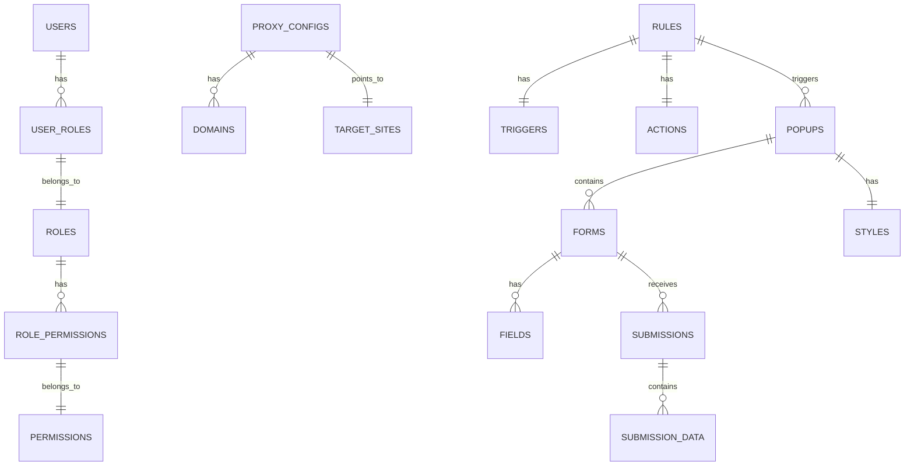

# Proxy Enhancer Ultra - 项目架构详解

## 📋 目录
1. [项目整体架构](#项目整体架构)
2. [技术栈详解](#技术栈详解)
3. [项目结构分析](#项目结构分析)
4. [路由系统原理](#路由系统原理)
5. [数据流架构](#数据流架构)
6. [核心模块详解](#核心模块详解)
7. [开发环境配置](#开发环境配置)
8. [部署架构](#部署架构)

## 🏗️ 项目整体架构

### 架构图
```
┌─────────────────────────────────────────────────────────────────┐
│                        用户访问层                                │
├─────────────────────────────────────────────────────────────────┤
│  ┌─────────────┐  ┌─────────────┐  ┌─────────────┐            │
│  │   代理域名   │  │  管理后台   │  │   API接口   │            │
│  │   (b.com)   │  │  (/admin)   │  │   (/api)    │            │
│  └─────────────┘  └─────────────┘  └─────────────┘            │
└─────────────────────────────────────────────────────────────────┘
                                │
                                ▼
┌─────────────────────────────────────────────────────────────────┐
│                    Go 统一服务层                                │
├─────────────────────────────────────────────────────────────────┤
│  ┌─────────────┐  ┌─────────────┐  ┌─────────────┐            │
│  │  路由分发器  │  │  中间件层   │  │  处理器层   │            │
│  │  gorilla/mux│  │  JWT/CORS   │  │  Handlers   │            │
│  └─────────────┘  └─────────────┘  └─────────────┘            │
│                                │                               │
│  ┌─────────────┐  ┌─────────────┐  ┌─────────────┐            │
│  │  代理服务   │  │  业务服务   │  │  数据访问   │            │
│  │  ReverseProxy│  │  Services   │  │    GORM     │            │
│  └─────────────┘  └─────────────┘  └─────────────┘            │
└─────────────────────────────────────────────────────────────────┘
                                │
                                ▼
┌─────────────────────────────────────────────────────────────────┐
│                        数据存储层                                │
├─────────────────────────────────────────────────────────────────┤
│  ┌─────────────┐  ┌─────────────┐  ┌─────────────┐            │
│  │ PostgreSQL  │  │   缓存     │  │   日志     │            │
│  │   (本地)    │  │   Redis     │  │  文件系统   │            │
│  └─────────────┘  └─────────────┘  └─────────────┘            │
└─────────────────────────────────────────────────────────────────┘
```

### 核心设计理念
- **统一入口**：所有请求通过同一个 Go 服务处理
- **模块化设计**：清晰的层次分离，便于维护和扩展
- **无侵入代理**：完全代理目标网站，保持原有功能
- **动态注入**：根据规则动态注入自定义功能

## 🛠️ 技术栈详解

### 后端技术栈

#### 1. **Go 1.21+**
- **版本要求**：Go 1.21 或更高版本
- **优势**：高性能、并发处理、内存管理
- **用途**：核心服务逻辑、反向代理、API 服务

#### 2. **Web 框架**
```go
// 标准库 + gorilla/mux
import (
    "net/http"
    "github.com/gorilla/mux"
)

// 路由注册示例
router := mux.NewRouter()
router.HandleFunc("/api/auth/login", authHandler.Login).Methods("POST")
router.HandleFunc("/admin/{rest:.*}", adminHandler.ServeAdmin).Methods("GET")
router.PathPrefix("/").HandlerFunc(proxyHandler.ServeProxy)
```

#### 3. **数据库 ORM**
```go
// GORM + PostgreSQL
import (
    "gorm.io/gorm"
    "gorm.io/driver/postgres"
)

// 数据库连接示例
dsn := "host=localhost user=postgres password=password dbname=proxy_platform port=5432 sslmode=disable"
db, err := gorm.Open(postgres.Open(dsn), &gorm.Config{})
```

#### 4. **认证系统**
```go
// JWT 认证
import "github.com/golang-jwt/jwt/v5"

// JWT 中间件示例
func JWTAuthMiddleware(next http.Handler) http.Handler {
    return http.HandlerFunc(func(w http.ResponseWriter, r *http.Request) {
        // JWT 验证逻辑
        token := r.Header.Get("Authorization")
        // ... 验证逻辑
        next.ServeHTTP(w, r)
    })
}
```

### 前端技术栈

#### 1. **Vue 3 + TypeScript**
```typescript
// 组件示例
<script setup lang="ts">
import { ref, onMounted } from 'vue'
import { useAuthStore } from '@/store/auth'

const authStore = useAuthStore()
const loading = ref(false)

const handleLogin = async () => {
  loading.value = true
  try {
    await authStore.login(username.value, password.value)
  } finally {
    loading.value = false
  }
}
</script>
```

#### 2. **状态管理 (Pinia)**
```typescript
// store/auth.ts
import { defineStore } from 'pinia'

export const useAuthStore = defineStore('auth', {
  state: () => ({
    user: null,
    token: null,
    isAuthenticated: false
  }),
  
  actions: {
    async login(username: string, password: string) {
      // 登录逻辑
    }
  }
})
```

#### 3. **路由系统 (Vue Router 4)**
```typescript
// router/index.ts
import { createRouter, createWebHistory } from 'vue-router'

const routes = [
  {
    path: '/admin',
    component: () => import('@/views/layout/AdminLayout.vue'),
    meta: { requiresAuth: true },
    children: [
      { path: 'proxy', component: () => import('@/views/proxy/ProxyManagement.vue') },
      { path: 'rules', component: () => import('@/views/rules/RulesManagement.vue') }
    ]
  }
]
```

## 📁 项目结构分析

### 目录结构详解

```
proxy-enhancer-ultra/
├── cmd/                           # 程序入口点
│   └── server/                    # 服务器主程序
│       └── main.go               # 主函数，启动服务器
├── internal/                      # 内部包（不对外暴露）
│   ├── auth/                     # 认证模块
│   │   └── jwt.go               # JWT 工具函数
│   ├── config/                   # 配置管理
│   │   └── config.go            # 配置结构体和加载逻辑
│   ├── database/                 # 数据库层
│   │   └── database.go          # 数据库连接和初始化
│   ├── handlers/                 # HTTP 处理器
│   │   ├── auth_handler.go      # 认证相关处理器
│   │   ├── proxy_handler.go     # 代理服务处理器
│   │   ├── rule_handler.go      # 规则管理处理器
│   │   └── ...                  # 其他处理器
│   ├── middleware/               # 中间件
│   │   └── middleware.go        # 认证、CORS、日志等中间件
│   ├── models/                   # 数据模型
│   │   └── models.go            # GORM 模型定义
│   ├── proxy/                    # 代理服务核心
│   │   └── proxy.go             # 反向代理实现
│   └── services/                 # 业务逻辑服务
│       ├── proxy_service.go      # 代理配置服务
│       ├── rule_service.go       # 规则管理服务
│       └── ...                   # 其他业务服务
├── pkg/                          # 公共包（可被外部引用）
│   ├── config/                   # 配置工具
│   ├── logger/                   # 日志工具
│   └── utils/                    # 通用工具函数
├── web/                          # 前端应用
│   ├── src/                      # 源代码
│   │   ├── api/                  # API 接口封装
│   │   ├── components/           # Vue 组件
│   │   ├── views/                # 页面视图
│   │   ├── store/                # Pinia 状态管理
│   │   ├── router/               # 路由配置
│   │   └── utils/                # 工具函数
│   ├── package.json              # 前端依赖配置
│   └── vite.config.ts            # Vite 构建配置
├── configs/                      # 配置文件目录
├── docs/                         # 项目文档
├── go.mod                        # Go 模块定义
├── go.sum                        # Go 依赖校验
└── config.yaml.example           # 配置文件模板
```

### 核心模块职责

#### 1. **cmd/server/main.go** - 程序入口
```go
func main() {
    // 1. 加载配置
    config := config.Load()
    
    // 2. 初始化数据库
    db := database.Init(config.Database)
    
    // 3. 初始化服务
    services := services.Init(db)
    
    // 4. 设置路由
    router := setupRouter(services)
    
    // 5. 启动服务器
    server := &http.Server{
        Addr:    config.Server.Address,
        Handler: router,
    }
    server.ListenAndServe()
}
```

#### 2. **internal/handlers/** - HTTP 处理器
- **职责**：处理 HTTP 请求，调用业务服务
- **特点**：只负责请求解析和响应格式化
- **示例**：
```go
func (h *ProxyHandler) CreateProxy(w http.ResponseWriter, r *http.Request) {
    var req CreateProxyRequest
    if err := json.NewDecoder(r.Body).Decode(&req); err != nil {
        http.Error(w, "Invalid request", http.StatusBadRequest)
        return
    }
    
    proxy, err := h.proxyService.CreateProxy(r.Context(), req)
    if err != nil {
        http.Error(w, err.Error(), http.StatusInternalServerError)
        return
    }
    
    json.NewEncoder(w).Encode(proxy)
}
```

#### 3. **internal/services/** - 业务逻辑服务
- **职责**：实现核心业务逻辑
- **特点**：与 HTTP 层解耦，可独立测试
- **示例**：
```go
func (s *ProxyService) CreateProxy(ctx context.Context, req CreateProxyRequest) (*Proxy, error) {
    // 1. 验证请求
    if err := s.validateRequest(req); err != nil {
        return nil, err
    }
    
    // 2. 创建代理配置
    proxy := &Proxy{
        Name:        req.Name,
        TargetURL:   req.TargetURL,
        ProxyDomain: req.ProxyDomain,
        IsActive:    false,
    }
    
    // 3. 保存到数据库
    if err := s.db.Create(proxy).Error; err != nil {
        return nil, err
    }
    
    return proxy, nil
}
```

## 🛣️ 路由系统原理

### 路由层次结构

#### 1. **管理后台路由** (`/admin/*`)
```
/admin
├── /admin/login          # 登录页面
├── /admin/proxy          # 代理管理页面
├── /admin/rules          # 规则配置页面
├── /admin/data           # 数据收集页面
└── /admin/settings       # 系统设置页面
```

#### 2. **API 接口路由** (`/api/*`)
```
/api
├── /api/auth
│   ├── POST /login       # 用户登录
│   └── POST /logout      # 用户登出
├── /api/proxy
│   ├── GET  /configs     # 获取代理配置列表
│   ├── POST /configs     # 创建代理配置
│   └── PUT  /configs/{id} # 更新代理配置
├── /api/rules            # 规则管理接口
├── /api/popups           # 弹窗管理接口
└── /api/submissions      # 数据提交接口
```

#### 3. **代理前台路由** (`/*`)
```
/* (通配符路由)
├── 所有其他请求都通过代理服务处理
├── 根据配置的规则决定是否注入弹窗
└── 返回代理后的网站内容
```

### 路由注册逻辑

```go
func setupRouter(services *Services) *mux.Router {
    router := mux.NewRouter()
    
    // 1. 静态文件服务（管理后台）
    router.PathPrefix("/admin").HandlerFunc(adminHandler.ServeAdmin)
    
    // 2. API 接口路由
    apiRouter := router.PathPrefix("/api").Subrouter()
    apiRouter.Use(middleware.CORS, middleware.Logging)
    
    // 认证相关接口（无需认证）
    apiRouter.HandleFunc("/auth/login", authHandler.Login).Methods("POST")
    
    // 需要认证的接口
    protectedRouter := apiRouter.PathPrefix("").Subrouter()
    protectedRouter.Use(middleware.JWTAuth)
    protectedRouter.HandleFunc("/proxy/configs", proxyHandler.GetConfigs).Methods("GET")
    protectedRouter.HandleFunc("/proxy/configs", proxyHandler.CreateConfig).Methods("POST")
    
    // 3. 代理服务路由（通配符，放在最后）
    router.PathPrefix("/").HandlerFunc(proxyHandler.ServeProxy)
    
    return router
}
```

### 路由优先级

1. **精确匹配**：`/admin`, `/api`
2. **前缀匹配**：`/admin/`, `/api/`
3. **通配符匹配**：`/*` (代理服务)

**重要**：代理服务的通配符路由必须放在最后，否则会拦截所有请求。

## 🔄 数据流架构

### 请求处理流程

```
用户请求 → 路由分发 → 中间件处理 → 处理器 → 业务服务 → 数据访问 → 数据库
    ↓           ↓           ↓         ↓         ↓         ↓         ↓
   HTTP      gorilla/mux  JWT/CORS  Handlers  Services   GORM    PostgreSQL
```

### 详细流程示例

#### 1. **管理后台页面访问**
```
GET /admin/proxy
    ↓
路由匹配: /admin/{rest:.*}
    ↓
中间件: CORS, Logging
    ↓
处理器: adminHandler.ServeAdmin
    ↓
返回: Vue 应用 HTML + 静态资源
```

#### 2. **API 接口调用**
```
POST /api/auth/login
    ↓
路由匹配: /api/auth/login
    ↓
中间件: CORS, Logging
    ↓
处理器: authHandler.Login
    ↓
业务服务: authService.Authenticate
    ↓
数据访问: userRepository.FindByUsername
    ↓
数据库: SELECT * FROM users WHERE username = ?
    ↓
返回: JWT Token + 用户信息
```

#### 3. **代理请求处理**
```
GET / (任意路径)
    ↓
路由匹配: /* (通配符)
    ↓
处理器: proxyHandler.ServeProxy
    ↓
业务服务: proxyService.ProcessRequest
    ↓
1. 获取目标网站内容
2. 检查触发规则
3. 注入弹窗/表单
4. 返回增强后的内容
```

### 数据模型关系



## 🔧 核心模块详解

### 1. **代理服务模块** (`internal/proxy/`)

#### 核心功能
- 反向代理目标网站
- 内容注入和修改
- 规则匹配和执行

#### 关键代码结构
```go
type ProxyService struct {
    db          *gorm.DB
    ruleService *RuleService
    config      *config.Config
}

func (s *ProxyService) ProcessRequest(w http.ResponseWriter, r *http.Request) {
    // 1. 创建反向代理
    proxy := httputil.NewSingleHostReverseProxy(targetURL)
    
    // 2. 修改响应内容
    proxy.ModifyResponse = func(resp *http.Response) error {
        // 检查是否需要注入弹窗
        if shouldInjectPopup(r.URL.Path) {
            return injectPopup(resp)
        }
        return nil
    }
    
    // 3. 执行代理
    proxy.ServeHTTP(w, r)
}
```

### 2. **规则引擎模块** (`internal/services/rule_service.go`)

#### 核心功能
- 规则条件匹配
- 触发动作执行
- 优先级管理

#### 规则配置示例
```json
{
  "name": "首页弹窗",
  "trigger_conditions": {
    "type": "url_pattern",
    "pattern": "^/$",
    "page_load": true
  },
  "actions": {
    "type": "inject_popup",
    "popup_id": "uuid-123",
    "delay": 3000
  },
  "priority": 1,
  "is_active": true
}
```

### 3. **弹窗注入模块**

#### 注入策略
1. **页面加载后注入**：DOM 加载完成后插入弹窗
2. **滚动触发注入**：用户滚动到指定位置时显示
3. **时间延迟注入**：页面加载后延迟指定时间显示
4. **点击触发注入**：用户点击特定元素时显示

#### 注入代码示例
```javascript
// 注入到页面的 JavaScript 代码
function injectPopup(popupConfig) {
    const popup = document.createElement('div')
    popup.innerHTML = popupConfig.html
    popup.className = 'proxy-popup'
    
    // 应用样式
    Object.assign(popup.style, popupConfig.styles)
    
    // 添加到页面
    document.body.appendChild(popup)
    
    // 绑定事件
    bindPopupEvents(popup, popupConfig)
}
```

## 🚀 开发环境配置

### 环境要求
```bash
# Go 环境
go version >= 1.21.0

# Node.js 环境
node version >= 18.0.0

# 数据库
PostgreSQL >= 12.0
```

### 开发启动步骤
```bash
# 1. 克隆项目
git clone <repository-url>
cd proxy-enhancer-ultra

# 2. 后端设置
go mod download
cp config.yaml.example config.yaml
# 编辑 config.yaml 配置数据库连接

# 3. 前端设置
cd web
npm install

# 4. 启动开发服务
# 终端 1: 启动后端
go run cmd/server/main.go

# 终端 2: 启动前端开发服务器
cd web && npm run dev
```

### 配置文件说明
```yaml
# config.yaml
server:
  host: "0.0.0.0"
  port: 8080

database:
  postgres:
    host: "localhost"
    port: 5432
    user: "postgres"
    password: "password"
    dbname: "proxy_platform"
    sslmode: "disable"

jwt:
  secret: "your-secret-key"
  expires_in: 24h
```

## 🚀 部署架构

### 生产环境部署

#### 1. **单机部署**
```bash
# 构建后端
go build -o bin/server cmd/server/main.go

# 构建前端
cd web && npm run build

# 启动服务
./bin/server
```

#### 2. **Docker 部署**
```dockerfile
# Dockerfile
FROM golang:1.21-alpine AS builder
WORKDIR /app
COPY . .
RUN go build -o server cmd/server/main.go

FROM alpine:latest
RUN apk --no-cache add ca-certificates
WORKDIR /root/
COPY --from=builder /app/server .
COPY --from=builder /app/web/dist ./web/dist
CMD ["./server"]
```

#### 3. **反向代理配置 (Nginx)**
```nginx
server {
    listen 80;
    server_name your-domain.com;
    
    location /admin {
        proxy_pass http://localhost:8080;
        proxy_set_header Host $host;
        proxy_set_header X-Real-IP $remote_addr;
    }
    
    location /api {
        proxy_pass http://localhost:8080;
        proxy_set_header Host $host;
        proxy_set_header X-Real-IP $remote_addr;
    }
    
    location / {
        proxy_pass http://localhost:8080;
        proxy_set_header Host $host;
        proxy_set_header X-Real-IP $remote_addr;
    }
}
```

### 性能优化建议

1. **数据库优化**
   - 使用连接池
   - 添加适当的索引
   - 定期清理历史数据

2. **缓存策略**
   - 规则配置缓存
   - 代理响应缓存
   - Redis 缓存热点数据

3. **并发处理**
   - 调整 Go 的 GOMAXPROCS
   - 使用 goroutine 池
   - 实现请求限流

## 📚 总结

Proxy Enhancer Ultra 是一个架构清晰、模块化程度高的智能反向代理平台。通过 Go 的高性能特性和 Vue 3 的现代化前端技术，实现了完整的代理功能和用户管理界面。

### 核心优势
- **统一架构**：前后端统一部署，简化运维
- **模块化设计**：清晰的职责分离，便于维护
- **高性能**：基于 Go 的并发处理能力
- **可扩展性**：支持插件化的规则引擎和动作系统

### 适用场景
- 企业营销活动页面增强
- 用户调研和数据收集
- 网站功能无侵入式扩展
- 代理服务定制化需求

这个项目展现了现代 Web 应用的最佳实践，无论是代码组织、技术选型还是架构设计都值得学习和借鉴。
