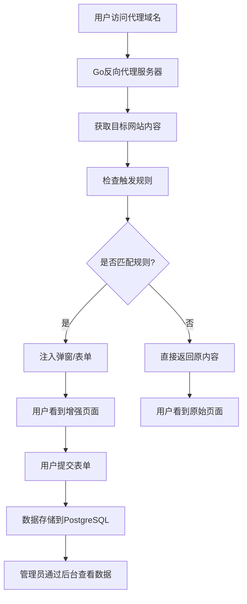

## 1. 产品概述

本系统是一个基于Go语言开发的智能反向代理平台，能够完全代理目标网站到自有域名，并在代理过程中注入自定义的交互功能。系统主要解决企业需要在不修改原网站代码的情况下，增加自定义交互功能（如弹窗、表单收集）的需求，适用于营销活动、用户调研、数据收集等场景。

为企业提供无侵入式的网站功能增强解决方案，降低技术门槛，提升用户交互体验。

## 2. 核心功能

### 2.1 用户角色

| 角色 | 注册方式 | 核心权限 |
|------|----------|----------|
| 系统管理员 | 系统预设账号 | 管理所有代理配置、查看所有数据、系统设置 |
| 运营人员 | 管理员后台添加 | 配置代理规则、设计弹窗表单、查看收集数据 |

### 2.2 功能模块

系统包含以下核心页面：

1. **代理管理页面**：代理配置、域名绑定、目标网站设置
2. **规则配置页面**：触发条件设置、弹窗表单设计、展示规则配置
3. **数据收集页面**：用户提交数据查看、数据导出、统计分析
4. **系统设置页面**：用户管理、权限配置、系统监控
5. **代理前台页面**：用户实际访问的代理网站界面

### 2.3 页面详情

| 页面名称 | 模块名称 | 功能描述 |
|----------|----------|----------|
| 代理管理页面 | 代理配置模块 | 添加、编辑、删除代理配置；设置目标网站URL；配置域名绑定 |
| 代理管理页面 | 状态监控模块 | 显示代理服务状态；监控流量统计；错误日志查看 |
| 规则配置页面 | 触发条件设置 | 配置URL路径匹配规则；设置触发时机（页面加载、接口调用等） |
| 规则配置页面 | 弹窗设计器 | 可视化设计弹窗样式；配置弹窗内容、按钮、表单字段 |
| 规则配置页面 | 表单构建器 | 拖拽式表单设计；字段类型选择；验证规则设置 |
| 数据收集页面 | 数据列表 | 实时显示用户提交数据；支持筛选、搜索、分页 |
| 数据收集页面 | 数据分析 | 提交量统计图表；数据趋势分析；导出Excel/CSV |
| 系统设置页面 | 用户管理 | 添加、编辑用户账号；权限分配；登录日志 |
| 系统设置页面 | 系统配置 | 数据库连接设置；缓存配置；安全参数设置 |
| 代理前台页面 | 内容代理 | 完全代理目标网站内容；保持原有样式和功能 |
| 代理前台页面 | 功能注入 | 根据配置规则注入弹窗；处理表单提交；数据收集 |

## 3. 核心流程

### 管理员流程
1. 登录管理后台
2. 配置代理目标网站（设置a.com为目标，b.com为代理域名）
3. 设置触发规则（指定哪些URL路径或接口触发自定义功能）
4. 设计弹窗和表单（配置样式、字段、验证规则）
5. 启动代理服务
6. 监控数据收集和系统状态

### 普通用户流程
1. 访问代理网站（b.com）
2. 浏览网站内容（与a.com完全一致）
3. 触发预设条件时看到弹窗或表单
4. 填写并提交表单数据
5. 继续正常浏览网站



## 4. 技术架构

### 4.1 后端技术栈
- **核心语言**：Go 1.21+
- **Web框架**：标准库 net/http + gorilla/mux
- **反向代理**：net/http/httputil.ReverseProxy
- **数据库**：Supabase PostgreSQL + GORM (支持后续迁移到本地PostgreSQL)
- **认证**：JWT (golang-jwt/jwt)
- **模板引擎**：html/template
- **配置管理**：Viper

### 4.2 前端技术栈
- **框架**：Vue 3 + TypeScript
- **UI组件库**：Element Plus
- **构建工具**：Vite
- **状态管理**：Pinia
- **HTTP客户端**：Axios

### 4.3 系统架构
```
┌─────────────────┐    ┌─────────────────────────────────┐
│   用户浏览器    │    │         Go统一服务               │
│                │───▶│                                 │
│ 访问代理域名   │    │  ┌─────────────┐ ┌─────────────┐ │
└─────────────────┘    │  │  代理服务   │ │  管理后台   │ │
                       │  │             │ │             │ │
                       │  │ 反向代理    │ │  Web API    │ │
                       │  │ 内容注入    │ │  JWT认证    │ │
                       │  └─────────────┘ └─────────────┘ │
                       └─────────────────────────────────┘
                                │
                                ▼
                       ┌─────────────────┐
                       │  Supabase       │
                       │  PostgreSQL     │
                       │  统一数据存储   │
                       └─────────────────┘
```

## 5. 用户界面设计

### 5.1 设计风格

- **主色调**：深黑色(#0a0a0a)作为主背景色，亮绿色(#00ff88)作为强调色和交互元素色
- **辅助色调**：深灰色(#1a1a1a)作为卡片背景，中灰色(#2a2a2a)作为边框色，浅绿色(#4ade80)作为次要强调色
- **按钮风格**：现代化圆角按钮，主要按钮使用绿色渐变(#00ff88到#4ade80)，支持发光悬停效果和流畅动画反馈
- **字体**：现代无衬线字体(Inter/SF Pro Display)，标题使用18-24px加粗，正文使用14-16px，代码字体使用JetBrains Mono
- **布局风格**：暗色左侧导航栏配绿色激活状态 + 深色主内容区域，采用现代化卡片式布局，支持微妙阴影和边框发光效果
- **图标风格**：使用现代化线性图标，支持绿色主题适配，激活状态带有绿色发光效果

### 5.2 页面设计概览

| 页面名称 | 模块名称 | UI元素 |
|----------|----------|--------|
| 代理管理页面 | 代理配置模块 | 深色背景表格展示代理列表，绿色渐变操作按钮（新增/编辑/删除），状态指示器（绿色发光运行/红色停止） |
| 代理管理页面 | 状态监控模块 | 深色实时数据卡片配绿色边框，绿色主题折线图显示流量趋势，深色日志列表滚动显示 |
| 规则配置页面 | 触发条件设置 | 深色背景URL输入框配绿色聚焦边框，暗色下拉选择触发类型，绿色开关按钮启用/禁用规则 |
| 规则配置页面 | 弹窗设计器 | 深色可视化预览区域，暗色属性配置面板，现代化颜色选择器，绿色主题字体大小滑块 |
| 数据收集页面 | 数据列表 | 深色分页表格配绿色表头，暗色搜索框，深色日期筛选器，绿色渐变导出按钮 |
| 数据收集页面 | 数据分析 | 绿色主题柱状图/饼图展示，深色数据统计卡片配绿色强调，暗色时间范围选择器 |
| 代理前台页面 | 功能注入 | 深色模态弹窗配绿色边框，半透明深色遮罩，暗色表单输入框配绿色聚焦效果，绿色渐变提交按钮动画效果 |

### 5.3 响应式设计

系统采用桌面优先设计，支持移动端自适应。管理后台主要面向桌面用户，代理前台页面需要完全适配移动端，确保在各种设备上都能正常显示和操作。

## 6. 项目结构

### 6.1 后端目录结构（遵循300行限制和单一职责原则）

```
proxy-platform/
├── cmd/
│   └── server/
│       └── main.go                    # 主程序入口（<100行）
├── internal/
│   ├── proxy/                         # 代理服务模块
│   │   ├── server/
│   │   │   ├── server.go              # 代理服务器核心（<200行）
│   │   │   ├── config.go              # 代理配置管理（<150行）
│   │   │   └── health.go              # 健康检查（<100行）
│   │   ├── injector/
│   │   │   ├── injector.go            # 内容注入器核心（<200行）
│   │   │   ├── html_parser.go         # HTML解析器（<150行）
│   │   │   ├── css_injector.go        # CSS注入器（<150行）
│   │   │   └── js_injector.go         # JavaScript注入器（<150行）
│   │   ├── rules/
│   │   │   ├── engine.go              # 规则引擎核心（<200行）
│   │   │   ├── matcher.go             # 规则匹配器（<150行）
│   │   │   ├── validator.go           # 规则验证器（<150行）
│   │   │   └── cache.go               # 规则缓存（<150行）
│   │   └── middleware/
│   │       ├── rate_limiter.go        # 速率限制（<150行）
│   │       ├── logging.go             # 请求日志（<150行）
│   │       └── security.go            # 安全中间件（<150行）
│   ├── admin/                         # 管理后台模块
│   │   ├── handlers/
│   │   │   ├── user_handler.go        # 用户管理处理器（<200行）
│   │   │   ├── proxy_handler.go       # 代理配置处理器（<200行）
│   │   │   ├── rule_handler.go        # 规则配置处理器（<200行）
│   │   │   ├── popup_handler.go       # 弹窗管理处理器（<200行）
│   │   │   ├── data_handler.go        # 数据收集处理器（<200行）
│   │   │   └── system_handler.go      # 系统设置处理器（<200行）
│   │   ├── middleware/
│   │   │   ├── auth.go                # JWT认证中间件（<200行）
│   │   │   ├── cors.go                # CORS处理（<150行）
│   │   │   ├── logging.go             # 管理后台日志（<150行）
│   │   │   └── rate_limit.go          # 管理后台限流（<150行）
│   │   ├── services/
│   │   │   ├── user_service.go        # 用户业务逻辑（<200行）
│   │   │   ├── proxy_service.go       # 代理业务逻辑（<200行）
│   │   │   ├── rule_service.go        # 规则业务逻辑（<200行）
│   │   │   ├── popup_service.go       # 弹窗业务逻辑（<200行）
│   │   │   └── data_service.go        # 数据业务逻辑（<200行）
│   │   └── validators/
│   │       ├── user_validator.go      # 用户数据验证（<150行）
│   │       ├── proxy_validator.go     # 代理配置验证（<150行）
│   │       ├── rule_validator.go      # 规则配置验证（<150行）
│   │       └── popup_validator.go     # 弹窗配置验证（<150行）
│   ├── models/                         # 数据模型
│   │   ├── user/
│   │   │   ├── user.go                # 用户基础模型（<150行）
│   │   │   ├── role.go                # 角色模型（<100行）
│   │   │   └── permission.go          # 权限模型（<100行）
│   │   ├── proxy/
│   │   │   ├── proxy_config.go        # 代理配置模型（<150行）
│   │   │   ├── domain.go              # 域名模型（<100行）
│   │   │   └── target_site.go         # 目标网站模型（<100行）
│   │   ├── rule/
│   │   │   ├── rule.go                # 规则基础模型（<150行）
│   │   │   ├── trigger.go             # 触发条件模型（<100行）
│   │   │   └── action.go              # 执行动作模型（<100行）
│   │   ├── popup/
│   │   │   ├── popup.go               # 弹窗基础模型（<150行）
│   │   │   ├── form.go                # 表单模型（<150行）
│   │   │   ├── field.go               # 表单字段模型（<100行）
│   │   │   └── style.go               # 样式配置模型（<100行）
│   │   └── data/
│   │       ├── submission.go          # 数据提交模型（<150行）
│   │       ├── analytics.go           # 数据分析模型（<100行）
│   │       └── export.go              # 数据导出模型（<100行）
│   ├── database/                       # 数据库层
│   │   ├── connection/
│   │   │   ├── manager.go             # 连接管理器（<200行）
│   │   │   ├── pool.go                # 连接池管理（<150行）
│   │   │   └── health.go              # 数据库健康检查（<100行）
│   │   ├── providers/
│   │   │   ├── interface.go           # 数据库提供者接口（<100行）
│   │   │   ├── supabase.go            # Supabase提供者（<200行）
│   │   │   └── postgresql.go          # 本地PostgreSQL提供者（<200行）
│   │   ├── migrations/
│   │   │   ├── manager.go             # 迁移管理器（<200行）
│   │   │   ├── schema.go              # 数据库模式定义（<150行）
│   │   │   └── seeder.go              # 初始数据填充（<150行）
│   │   └── repositories/
│   │       ├── user_repo.go           # 用户数据仓库（<200行）
│   │       ├── proxy_repo.go          # 代理配置仓库（<200行）
│   │       ├── rule_repo.go           # 规则配置仓库（<200行）
│   │       ├── popup_repo.go          # 弹窗配置仓库（<200行）
│   │       └── data_repo.go           # 数据收集仓库（<200行）
│   ├── config/                         # 配置管理
│   │   ├── config.go                  # 配置管理器（<200行）
│   │   ├── database.go                # 数据库配置（<150行）
│   │   ├── server.go                  # 服务器配置（<150行）
│   │   └── security.go                # 安全配置（<150行）
│   ├── utils/                          # 工具函数
│   │   ├── crypto.go                  # 加密工具（<150行）
│   │   ├── jwt.go                     # JWT工具（<150行）
│   │   ├── response.go                # HTTP响应工具（<100行）
│   │   ├── logger.go                  # 日志工具（<150行）
│   │   └── validator.go               # 通用验证工具（<150行）
│   └── errors/                         # 错误处理
│       ├── errors.go                  # 错误定义（<150行）
│       ├── http_errors.go             # HTTP错误（<100行）
│       └── validation_errors.go       # 验证错误（<100行）
├── web/                                # 前端静态文件
│   ├── dist/                           # Vue3构建输出
│   ├── templates/                      # Go模板文件
│   └── assets/                         # 静态资源
├── configs/                            # 配置文件
│   ├── database.yaml                   # 数据库配置
│   ├── server.yaml                     # 服务器配置
│   └── security.yaml                   # 安全配置
├── scripts/                            # 脚本文件
│   ├── build.sh                        # 构建脚本
│   ├── deploy.sh                       # 部署脚本
│   └── migrate.sh                      # 数据迁移脚本
├── tests/                              # 测试文件
│   ├── unit/                           # 单元测试
│   ├── integration/                    # 集成测试
│   └── e2e/                            # 端到端测试
├── docs/                               # 文档
│   ├── api/                            # API文档
│   ├── deployment/                     # 部署文档
│   └── development/                    # 开发文档
├── go.mod
└── go.sum
```

### 6.2 核心模块说明（遵循单一职责原则）

#### 代理服务模块 (internal/proxy/)
- **server/**：代理服务器核心功能，包括服务器启动、配置管理、健康检查
- **injector/**：内容注入功能，分别处理HTML、CSS、JavaScript的注入逻辑
- **rules/**：规则引擎，包括规则匹配、验证、缓存等核心功能
- **middleware/**：代理服务中间件，处理限流、日志、安全等横切关注点

#### 管理后台模块 (internal/admin/)
- **handlers/**：HTTP请求处理器，每个文件负责一个功能域的API端点
- **middleware/**：管理后台中间件，包括认证、CORS、日志、限流等
- **services/**：业务逻辑层，将复杂的业务规则从处理器中分离
- **validators/**：数据验证层，确保输入数据的完整性和正确性

#### 数据模型模块 (internal/models/)
- **user/**：用户相关模型，包括用户、角色、权限的分离
- **proxy/**：代理配置相关模型，分离配置、域名、目标网站
- **rule/**：规则相关模型，分离规则、触发条件、执行动作
- **popup/**：弹窗相关模型，分离弹窗、表单、字段、样式
- **data/**：数据收集相关模型，分离提交、分析、导出

#### 数据库模块 (internal/database/)
- **connection/**：数据库连接管理，包括连接池、健康检查
- **providers/**：数据库提供者抽象，支持Supabase和本地PostgreSQL
- **migrations/**：数据库迁移管理，包括模式定义和初始数据
- **repositories/**：数据访问层，每个文件负责一个模型的数据操作

#### 配置和工具模块
- **config/**：配置管理，分离不同配置域的管理逻辑
- **utils/**：通用工具函数，每个文件专注于特定功能
- **errors/**：错误处理，分离不同类型的错误定义和处理

### 6.3 文件大小控制策略

#### 拆分原则
1. **功能域分离**：每个文件只负责一个明确的功能域
2. **层次分离**：将复杂的业务逻辑按层次分离到不同文件
3. **关注点分离**：将横切关注点（如日志、认证、验证）分离到专门文件

#### 具体拆分示例
- **大型处理器**：将复杂的HTTP处理器按功能域拆分为多个文件
- **复杂模型**：将包含多个关联实体的模型拆分为独立的文件
- **业务服务**：将复杂的业务逻辑拆分为多个专注的服务文件
- **数据仓库**：将数据访问逻辑按模型类型分离

#### 文件大小监控
- 每个文件严格控制在300行以内
- 超过250行时考虑进一步拆分
- 定期进行代码审查，确保文件大小符合要求

## 7. 数据库配置

### 7.1 Supabase PostgreSQL 配置

系统优先使用 Supabase 的托管 PostgreSQL 服务，提供以下优势：

- **快速部署**：无需本地数据库安装和配置
- **自动备份**：Supabase 提供自动数据备份和恢复
- **扩展性**：支持数据库连接池和性能优化
- **监控**：内置数据库性能监控和日志

### 7.2 数据库连接配置

```go
// configs/database.yaml
database:
  provider: "supabase"  # 可选: "supabase" 或 "local"
  supabase:
    url: "https://your-project.supabase.co"
    key: "your-anon-key"
    db_host: "db.your-project.supabase.co"
    db_port: 5432
    db_name: "postgres"
    db_user: "postgres"
    db_password: "your-db-password"
    ssl_mode: "require"
  local:
    host: "localhost"
    port: 5432
    name: "proxy_platform"
    user: "postgres"
    password: "your-password"
    ssl_mode: "disable"
```

### 7.3 迁移策略

系统设计支持从 Supabase 平滑迁移到本地 PostgreSQL：

1. **配置切换**：通过配置文件切换数据库提供者
2. **数据导出**：支持从 Supabase 导出数据到本地
3. **连接管理**：统一的数据库连接接口，支持不同提供者
4. **迁移脚本**：提供数据迁移和验证工具

### 7.4 环境变量配置

```bash
# .env
DB_PROVIDER=supabase
SUPABASE_URL=https://your-project.supabase.co
SUPABASE_ANON_KEY=your-anon-key
SUPABASE_DB_HOST=db.your-project.supabase.co
SUPABASE_DB_PASSWORD=your-db-password

# 本地数据库配置（备用）
LOCAL_DB_HOST=localhost
LOCAL_DB_PORT=5432
LOCAL_DB_NAME=proxy_platform
LOCAL_DB_USER=postgres
LOCAL_DB_PASSWORD=your-password

## 8. 代码组织最佳实践

### 8.1 文件拆分示例

#### 原始大型文件（超过300行）
```go
// internal/admin/handlers/user_handler.go - 原始版本（超过300行）
package handlers

type UserHandler struct {
    // 用户管理、认证、权限、日志等所有功能
}

func (h *UserHandler) CreateUser() { /* 50行 */ }
func (h *UserHandler) UpdateUser() { /* 50行 */ }
func (h *UserHandler) DeleteUser() { /* 50行 */ }
func (h *UserHandler) AuthenticateUser() { /* 50行 */ }
func (h *UserHandler) AuthorizeUser() { /* 50行 */ }
func (h *UserHandler) LogUserActivity() { /* 50行 */ }
// ... 更多方法
```

#### 拆分后的文件结构
```go
// internal/admin/handlers/user_handler.go - 核心用户操作（<200行）
package handlers

type UserHandler struct {
    userService    services.UserService
    authService    services.AuthService
    validator      validators.UserValidator
}

func (h *UserHandler) CreateUser() { /* 30行 */ }
func (h *UserHandler) UpdateUser() { /* 30行 */ }
func (h *UserHandler) DeleteUser() { /* 30行 */ }
func (h *UserHandler) GetUser() { /* 30行 */ }
func (h *UserHandler) ListUsers() { /* 30行 */ }
```

```go
// internal/admin/handlers/auth_handler.go - 认证相关（<150行）
package handlers

type AuthHandler struct {
    authService    services.AuthService
    validator      validators.AuthValidator
}

func (h *AuthHandler) Login() { /* 40行 */ }
func (h *AuthHandler) Logout() { /* 30行 */ }
func (h *AuthHandler) RefreshToken() { /* 40行 */ }
func (h *AuthHandler) ChangePassword() { /* 40行 */ }
```

```go
// internal/admin/handlers/permission_handler.go - 权限管理（<150行）
package handlers

type PermissionHandler struct {
    permissionService services.PermissionService
    validator         validators.PermissionValidator
}

func (h *PermissionHandler) AssignRole() { /* 40行 */ }
func (h *PermissionHandler) RevokeRole() { /* 30行 */ }
func (h *PermissionHandler) CheckPermission() { /* 40行 */ }
func (h *PermissionHandler) ListPermissions() { /* 40行 */ }
```

### 8.2 服务层拆分示例

#### 原始大型服务（超过300行）
```go
// internal/admin/services/user_service.go - 原始版本（超过300行）
package services

type UserService struct {
    // 用户CRUD、认证、权限、日志等所有业务逻辑
}

func (s *UserService) CreateUser() { /* 60行 */ }
func (s *UserService) UpdateUser() { /* 60行 */ }
func (s *UserService) DeleteUser() { /* 60行 */ }
func (s *UserService) AuthenticateUser() { /* 60行 */ }
func (s *UserService) AuthorizeUser() { /* 60行 */ }
// ... 更多方法
```

#### 拆分后的服务结构
```go
// internal/admin/services/user_service.go - 用户CRUD操作（<200行）
package services

type UserService struct {
    userRepo    repositories.UserRepository
    validator   validators.UserValidator
}

func (s *UserService) CreateUser() { /* 50行 */ }
func (s *UserService) UpdateUser() { /* 50行 */ }
func (s *UserService) DeleteUser() { /* 50行 */ }
func (s *UserService) GetUser() { /* 30行 */ }
func (s *UserService) ListUsers() { /* 20行 */ }
```

```go
// internal/admin/services/auth_service.go - 认证业务逻辑（<200行）
package services

type AuthService struct {
    userRepo    repositories.UserRepository
    crypto      utils.Crypto
    jwt         utils.JWT
}

func (s *AuthService) AuthenticateUser() { /* 60行 */ }
func (s *AuthService) GenerateToken() { /* 40行 */ }
func (s *AuthService) ValidateToken() { /* 40行 */ }
func (s *AuthService) RefreshToken() { /* 60行 */ }
```

### 8.3 模型拆分示例

#### 原始大型模型（超过300行）
```go
// internal/models/user.go - 原始版本（超过300行）
package models

type User struct {
    ID          uint      `json:"id" gorm:"primaryKey"`
    Username    string    `json:"username"`
    Email       string    `json:"email"`
    Password    string    `json:"-"`
    RoleID      uint      `json:"role_id"`
    Role        Role      `json:"role"`
    Permissions []Permission `json:"permissions"`
    CreatedAt   time.Time `json:"created_at"`
    UpdatedAt   time.Time `json:"updated_at"`
    LastLoginAt time.Time `json:"last_login_at"`
    // ... 更多字段
}

// 用户相关方法
func (u *User) BeforeCreate() { /* 30行 */ }
func (u *User) BeforeUpdate() { /* 30行 */ }
func (u *User) Validate() { /* 40行 */ }
func (u *User) HasPermission() { /* 30行 */ }
func (u *User) IsAdmin() { /* 20行 */ }
// ... 更多方法
```

#### 拆分后的模型结构
```go
// internal/models/user/user.go - 用户基础模型（<150行）
package user

type User struct {
    ID          uint      `json:"id" gorm:"primaryKey"`
    Username    string    `json:"username"`
    Email       string    `json:"email"`
    Password    string    `json:"-"`
    RoleID      uint      `json:"role_id"`
    CreatedAt   time.Time `json:"created_at"`
    UpdatedAt   time.Time `json:"updated_at"`
    LastLoginAt time.Time `json:"last_login_at"`
}

// 基础方法
func (u *User) BeforeCreate() { /* 30行 */ }
func (u *User) BeforeUpdate() { /* 30行 */ }
func (u *User) Validate() { /* 40行 */ }
func (u *User) GetFullName() { /* 20行 */ }
```

```go
// internal/models/user/role.go - 角色模型（<100行）
package user

type Role struct {
    ID          uint   `json:"id" gorm:"primaryKey"`
    Name        string `json:"name"`
    Description string `json:"description"`
    Permissions []Permission `json:"permissions"`
}

func (r *Role) HasPermission() { /* 40行 */ }
func (r *Role) AddPermission() { /* 30行 */ }
func (r *Role) RemovePermission() { /* 30行 */ }
```

```go
// internal/models/user/permission.go - 权限模型（<100行）
package user

type Permission struct {
    ID          uint   `json:"id" gorm:"primaryKey"`
    Name        string `json:"name"`
    Resource    string `json:"resource"`
    Action      string `json:"action"`
}

func (p *Permission) IsValid() { /* 30行 */ }
func (p *Permission) GetFullName() { /* 20行 */ }
```

### 8.4 代码组织检查清单

#### 文件大小检查
- [ ] 每个文件是否控制在300行以内？
- [ ] 超过250行的文件是否已考虑拆分？
- [ ] 是否定期进行文件大小审查？

#### 职责分离检查
- [ ] 每个文件是否只负责一个明确的功能域？
- [ ] 是否遵循单一职责原则？
- [ ] 复杂的业务逻辑是否已分离到服务层？

#### 依赖关系检查
- [ ] 文件间的依赖关系是否清晰？
- [ ] 是否存在循环依赖？
- [ ] 是否使用了适当的接口进行解耦？

#### 测试覆盖检查
- [ ] 每个文件是否都有对应的测试文件？
- [ ] 测试是否覆盖了所有主要功能？
- [ ] 是否遵循测试驱动开发原则？
```
